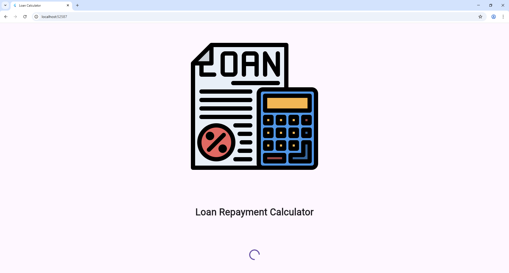
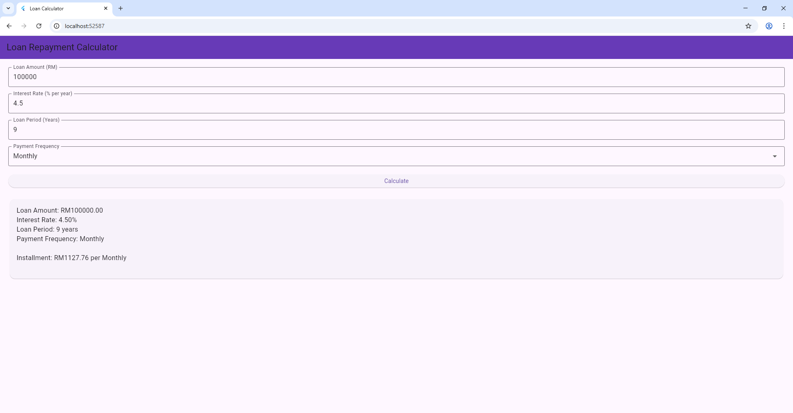

# 💰 Flutter Loan Repayment Calculator App

## 📱 App Purpose and Features

This is a simple **Flutter Loan Repayment Calculator App** that built using **Flutter**. It allows users to input loan details and calculate the installment amount based on selected frequency.

### ✨ Key Features

- Splash screen with app branding and loading indicator  
- Input loan amount, interest rate, and loan period  
- Select payment frequency: Monthly, Quarterly, or Yearly  
- Calculates fixed installment payments using amortization formula  
- Validates user input and shows error messages  
- Displays a clear summary of loan details and results

---

## 🖼️ Screenshots

| Splash Screen | Loan Calculator Screen |
|---------------|------------------------|
|  |  |

---

## 🚀 How to Run the App

1. **Clone the repo**
   ```bash
   git clone https://github.com/mily86/loan-calculator.git
   cd flutter-loan-calculator


This assigement helped me to understand several Flutter concepts:

- Navigating between screens using Navigator and pushReplacement

- Managing app lifecycle with initState and Future.delayed for splash timing

- Building responsive layouts with Column, Center, and Padding

- Using Image.asset to display images from assets

- Handling user input with TextEditingController and validation

- Implementing dropdown menus and calculation logic in a stateful widget